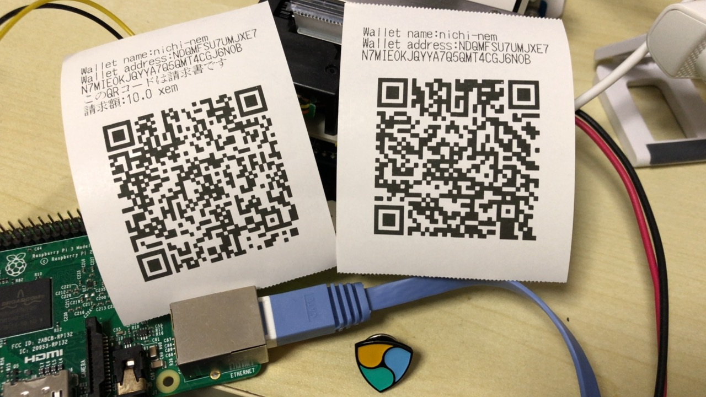
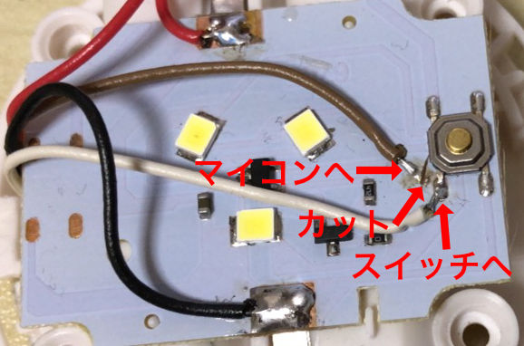

# nem-QR-Printer
Capture nem wallet QR code and Print it.

暗号通貨nemのwallet QRコードをwebcamでキャプチャして、プリンタからQRコードを出力します。  
プリンタはナダ電子 プリンタシールド [AS-289R2](http://www.nada.co.jp/as289r2/)を使いました。

### 必要な物

- ハードウェア
  - [Raspberry Pi 3](https://www.switch-science.com/catalog/3050/) (たぶん2でも可)
  - ナダ電子 プリンタシールド [AS-289R2](https://www.switch-science.com/catalog/2553/)
  - LED付き押しボタン(ダイソー)
  - webカメラ (今回は [iBUFFALO BSWHD06M](https://amazon.jp/o/ASIN/B00GZAF89W/opencollect-22) を使いました)
- ソフトウェア
  - Python3パッケージ
    - qrcode (QRコード生成)
    - zbarlight (QRコード認識)
    - serial (シリアル通信)
    - WiringPi (GPIO制御など)
  - fswebcam (webカメラキャプチャ)

### 準備

キャプチャ画像を保存するためにRAM上にファイルシステムを構築しています。/etc/fstab を編集して/work/としてtmpfsを作っておいてください。

### 動作について

1. qr2qr.pyを実行します。
1. 起動するとカメラが1秒おきに撮影し、取った画像を解析します。
1. 画像をQRコードとして解析できたら、LEDボタンのLEDを点灯してボタンが押されるのを待ちます。
1. ボタンが押されたらQRコードの内容をQRコードにして印刷します。

請求書QRコードにも対応しています。

### プリンタシールドについて

ナダ電子 プリンタシールド AS-289R2はシリアルでコマンドを送るだけでいろいろな印刷ができる便利なプリンタです。ビットマップ出力部分はナダ電子の[DitherCamera](https://github.com/NADA-ELECTRONICS/DitherCamera)を参考にしました。  
今回38400bpsで通信しているので、プリンタシールドの設定変更(はんだ付けによるジャンパ設定)が必要です。

### カメラについて

webカメラとしてfswebcamで画像が撮れる物なら何でもいいはずです。/dev/video0 決め打ちでキャプチャしているので、違ったら変えてください。

### LEDボタンについて
LED付き押しボタンとして、100円ショップダイソーで売っていたLEDライトを使いました。
回路は[１００均ライト改造報告Ｎｏ.２３【2017/5/29駆動回路：LEDﾐﾆﾀｯﾁﾗｲﾄ蒼】](http://yamane-factory.cocolog-nifty.com/yamane/2017/03/2017324led-0eb5.html)を参考にしました。スイッチとマイコンの間の配線をカットして、それぞれの線を引き出してRaspberry PiのGPIOに接続します。また、電源もRaspberry Piの3.3Vから供給しています。もちろんGNDも接続してください。  
マイコンへの配線をGPIO27、ボタンからの配線をGPIO17につないでください。Raspberry Pi内でプルアップしているのでボタンの配線にプルアップ抵抗を付ける必要はありません。

### 既知のバグ

ウォレット名やメッセージに日本語が入ったQRコードでは文字化けすることがあります。どうやらQRコードのデコードか、デコード後の文字列変換で失敗するようです。今のところあまり活用されていないようなので追っていません。

### ライセンス
MIT

### Donation

nem: NDQMFS-U7UMJX-E7N7MI-EOKJQY-YA7Q5Q-MT4CGJ-6NOB  
nekonium: 0xf25d84ae5430ad5107801af46f2408dd6b0b43b0
